# RISC-V Pipelined Core Implementation

This project showcases the design and implementation of a RISC-V Pipelined Core processor with Hazard Unit using Verilog HDL.The RTL schematic has been designed and simulation has been performed using Siemens Questasim 10.7c.

It is the modification of the previously designed [RISC-V Single Cycle Core processor](https://github.com/LaharB/RISCV_Single_Cycle_Core) where the processor executes a complete instruction in one clock cycle *(The time period of the clock cycle is decided by the execution time of the slowest instruction which is generally the loadWord instruction.)*

It is based on the **RV32I Base Integer Instruction Set Architecture** where the processor processes 32-bit wide data and instructions.

---------------------------------------------------------------------------------------

## What is pipelining ?

- Pipelining is a technique used to improve processor throughput by dividing instruction execution into a sequence of distinct stages. This allows **multiple instructions to be processed simultaneously, ideally completing one instruction per clock cycle once the pipeline is full.**
- In Pipelined processor, each stage gets executed in one clock cycle whose time period is decided by the fastest instruction or instruction having the shortest datapath.

----------------------------------

## RISC-V Pipelined Architecture Diagram

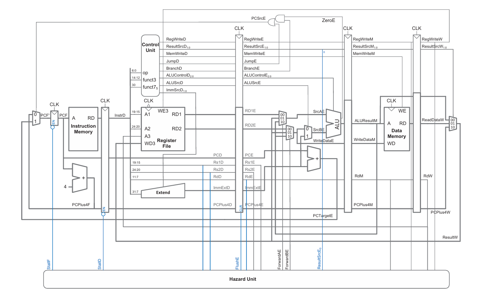

-------------------------------------

## The 5-Stage Datapath

The classic RISC-V pipeline is divided into five stages where each of these stages is completed within one clock cycle.Following points explain how data flows through these stages which is essential for a complete architectural overview.

1. **Instruction Fetch(IF):** The processor retrieves the next 32-bit instruction from the Instruction Memory using the current address stored in the Program Counter (PC). The PC is simultaneously updated to point to the next sequential instruction (PC + 4).
  
2. **Instruction Decode (ID):** The fetched instruction is parsed. The control unit extracts the opcode to generate necessary control signals. Simultaneously, the required source registers (rs1, rs2) are read from the Register File. Immediate generation logic also extends immediate values to 32 bits.
   
3. **Execute (EX):** The Arithmetic Logic Unit (ALU) performs the computation dictated by the instruction (e.g., addition, subtraction, bitwise operations). For memory access instructions, the ALU computes the effective memory address. For branch instructions, the branch condition is evaluated here.

4. **Memory Access (MEM):** This stage is active only for load and store instructions. Data is either read from or written to the Data Memory at the address calculated in the EX stage. Non-memory instructions simply pass their results through this stage.

5. **Write Back (WB):** The final operation result—either the output from the ALU or the data fetched from the Data Memory—is written back into the destination register (rd) in the Register File.
   
----------------------------------

## Supported Instructions 

Some modifications have been done in the Main Decoder and Immediate Extend logic (shown in the following truth tables respectively) to support **I-Type ALU** instructions as well as **J-Type instrcution(jal)**.

### Main Decoder truth table enhanced to support I-type ALU and jal

| Instruction | Opcode | RegWrite | ImmSrc | ALUSrc | MemWrite | ResultSrc | Branch | ALUOp | Jump |
| :--- | :--- | :---: | :---: | :---: | :---: | :---: | :---: | :---: | :---: |
| `lw` | 0000011 | 1 | 00 | 1 | 0 | 01 | 0 | 00 | 0 |
| `sw` | 0100011 | 0 | 01 | 1 | 1 | xx | 0 | 00 | 0 |
| `R-type` | 0110011 | 1 | xx | 0 | 0 | 00 | 0 | 10 | 0 |
| `beq` | 1100011 | 0 | 10 | 0 | 0 | xx | 1 | 01 | 0 |
| `I-type ALU` | 0010011 | 1 | 00 | 1 | 0 | 00 | 0 | 10 | 0 |
| `jal` | 1101111 | 1 | 11 | x | 0 | 10 | 0 | xx | 1 |

---

### ImmSrc encoding

| ImmSrc | ImmExt | Type | Description |
| :---: | :--- | :---: | :--- |
| 00 | `{{20{Instr[31]}}, Instr[31:20]}` | I | 12-bit signed immediate |
| 01 | `{{20{Instr[31]}}, Instr[31:25], Instr[11:7]}` | S | 12-bit signed immediate |
| 10 | `{{20{Instr[31]}}, Instr[7], Instr[30:25], Instr[11:8], 1'b0}` | B | 13-bit signed immediate |
| 11 | `{{12{Instr[31]}}, Instr[19:12], Instr[20], Instr[30:21], 1'b0}` | J | 21-bit signed immediate |

So now, following are the types of Instructions supported by the design:

- R-type(add, sub, and, or)
- I-type(addi, subi, andi, ori, lw)
- S-type(sw)
- B-type(beq)
- J-type(jal)
  
-------------------------------------------------------

## Pipeline Hazards and Resolutions

1. **Data Hazards** 
- These occur when an instruction depends on the result of a preceding instruction that has not yet completed its write-back phase.
   
- Resolution: Implementing Data Forwarding (or bypassing) routes the ALU output or memory data directly back to the ALU inputs, avoiding the wait for the WB stage. For "load-use" data hazards, where forwarding isn't enough, a TStalling functionality is used to stall the pipeline (inserting a "bubble" or NOP) for one cycle.

1. **Structural Hazards** 

- These happen when hardware resources are insufficient to support all simultaneous instruction combinations (e.g., a single memory port for both instruction fetch and data access).

- Resolution: Utilizing a Harvard architecture, which separates Instruction Memory and Data Memory, inherently prevents structural hazards related to memory access.
  
1. **Control Hazards**
 
- These arise from branch and jump instructions that modify the PC. The pipeline might fetch incorrect instructions before the branch condition and target address are fully resolved in the EX stage.

- Resolution: To handle this, the pipeline must flush the incorrect instructions that entered the IF and ID stages. More advanced designs might include static or dynamic branch prediction to minimize these flushes.

Currently, the processor supports Data Hazards resolution using Forwarding/Bypassing and Stalling technique.It doesnt resolve any control hazard if it occurs.

------------------------------------------------------

## Sample Instruction Code

The following set of instructions have been simulated in single-cycle core :

### Sample Code 1

This code will produce Data Hazard situation.

```asm
00500293 // addi x5, x0, 0x5 
00300313 // addi x6, x0, 0x3
006283B3 // add x7, x5, x6
00002403 // lw x8, 0x0(x0)
00100493 // addi x9, x0, 0x1
00940533 // add x10, x8, x9
```
### Sample Code 2

This code will produce Data Hazard situation as there is a dependency of the addi instruction just after the lw instruction.

```asm
00500293 // addi x5, x0, 0x5 
00300313 // addi x6, x0, 0x3 
006283B3 // add x7, x5, x6 
02702423 // sw x7, 40(x0) 
02802403 // lw x8, 40(x0) 
00140493 // addi x9, x8, 0x1 
00848533 // add x10, x9, x8
```
------------------------------------------------------
<details><summary>Schematics</summary><br>

The schematics have been generated using Questasim 10.7c 

1. Pipelined Processor Core without **Hazard Unit**  
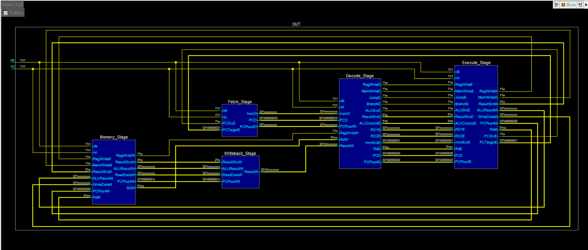

1. Pipelined Processor Core with **Hazard Unit but no Stalling Functionality**
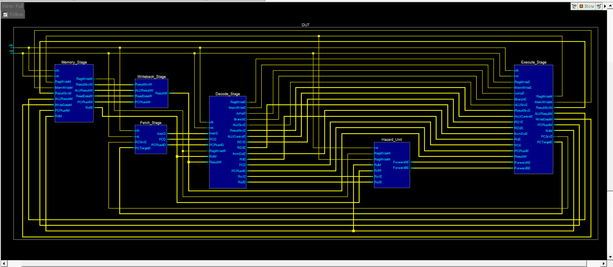

1. Pipelined Processor Core with **Hazard Unit with Stalling Functionality**
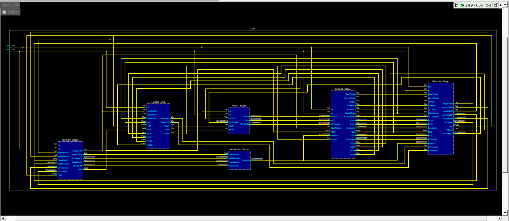

</details>

-------------------------------------------------------------

<details><summary>Simulation</summary><br>

The simulations have been performed using using Questasim 10.7c.

1. Without any Hazard Unit

- Sample Code 1

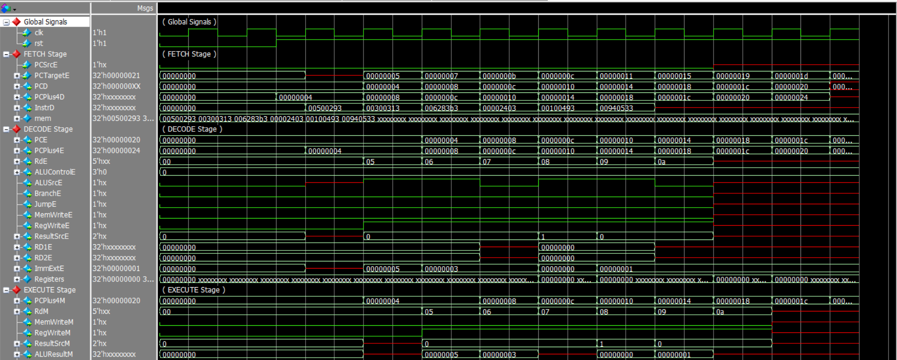
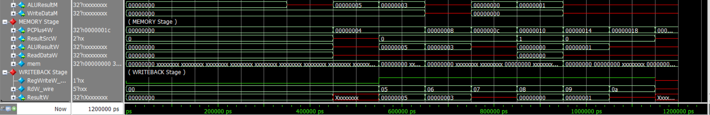

1. Hazard Unit without any Stalling Funtionality

- Sample Code 1 

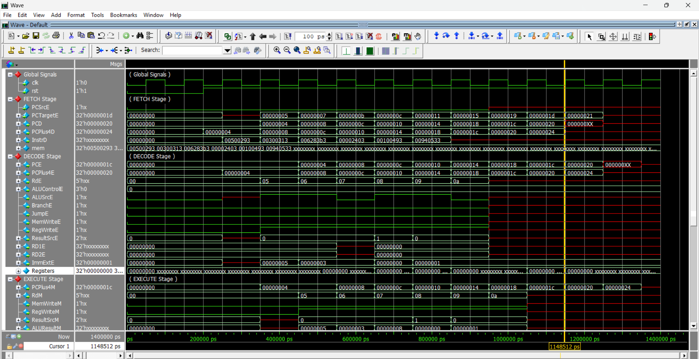
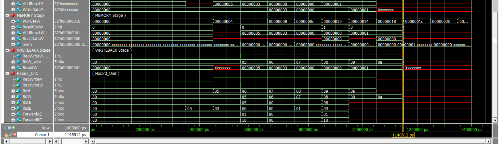
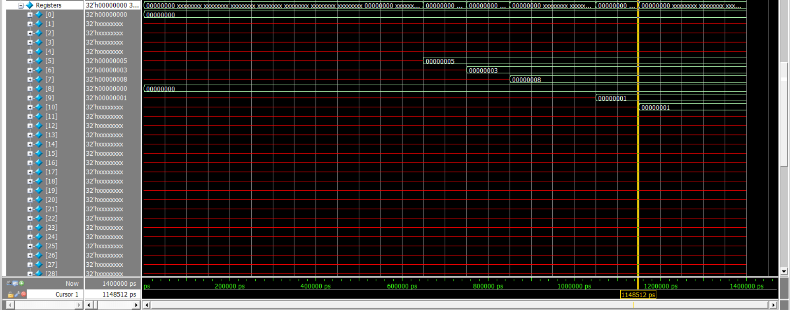

- Sample Code 2
  
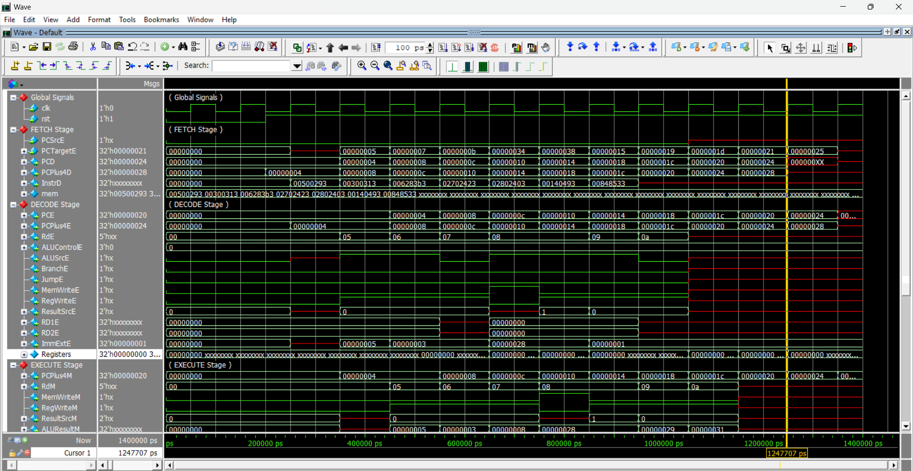
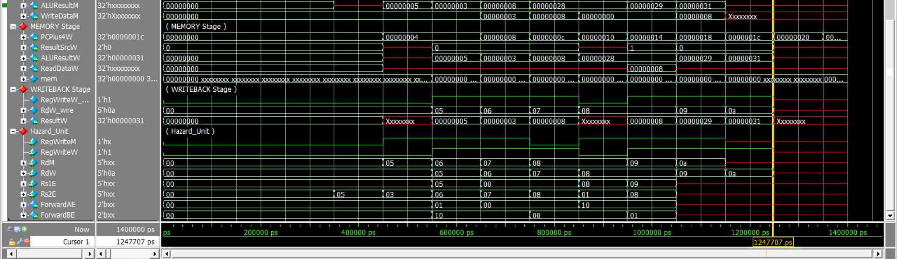
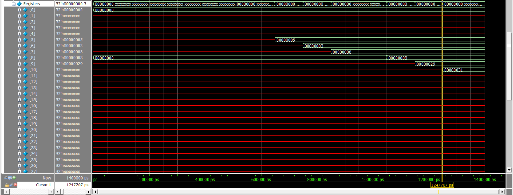

3. Hazard Unit with Stalling Funtionality 

- Sample Code 2

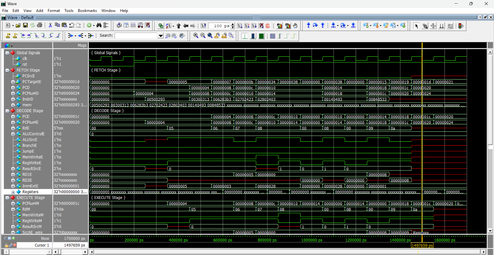
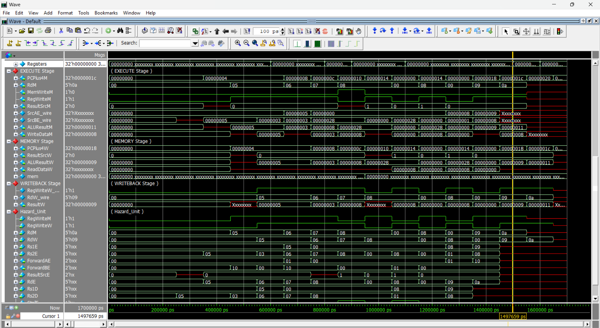  
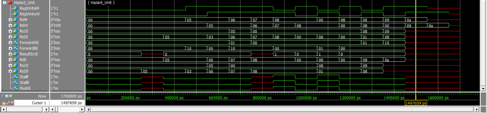
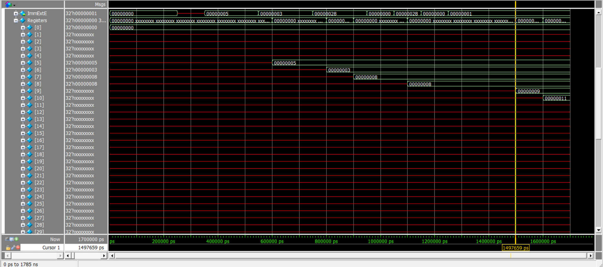

</details>

-----------------------------------------

## Simulation Steps

To compile the RTL and simulate the design , run the run.do file in Questasim.

------------------------------------------

## References & Acknowledgments

This project was built with reference to the following materials:

S. L. Harris and D. M. Harris, Digital Design and Computer Architecture: RISC-V Edition. Morgan Kaufmann, 2022.